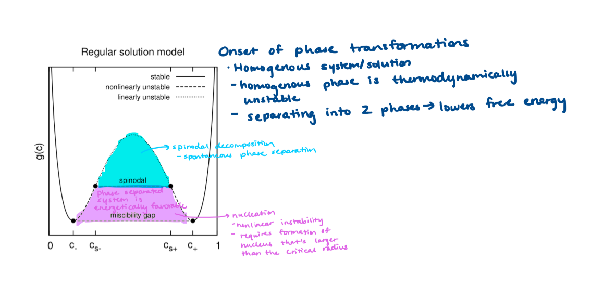

## Microscopy options

* Laser scanning confocal
    + Point laser excitation/single beam on sample
    + Sequential scan across sample in a point-by-point raster pattern 
    + Single emission pinhole that rejects light from out of focus areas
    + Small apertures
        - a lot of rejected light
        - need high-intensity excitation sources 
* Spinning disc confocal 
    + Rotating opaque disk with many pinholes arranged in spiral pattern
    + Disc spins at high speeds
    + Opaque areas block out-of-focus light from excitation and emission light paths
        - Pinhole blocks light coming from out-of-focus and reduces image blurring
    + Pinholes scan across sample in rows
* LICASP8 STED 
    + Wide light laser 470-670 nm 
    + 3 depletion lines: 592, 670, 775
* Lattice-light sheet: 3D and fast 
    + AF dye compatible 
    + Illuminates thin section that is orthogonal to detection path

## Super-res: STORM basics
* Photodegradation of fluorophore
    + Triplet-excited state: intermediate that is prone to undergo energy-transfer or electron transfer reactions with oxygen, which leads to photobleaching 
    + Oxygen quenches fluorophores in the triplet state
        - Oxidized dyes are no longer fluorescent 
    + Triplet states contribute to dye instability 
* If fluorophore stays in triplet state for long time (half a second) —-> will be dark
* Laser excitation pushes fluorophore to dark state, and then single fluorosphores stochastically return to an emissive state, excited and detected
    + When fluorophore absorbs light, electrons are excited from ground state to excited singlet state
    + Relaxation to ground state results in emission of fluorescence 
    + When electron is excited to high energy singly state, it may go into triplet state
triplet state is a long off state 
* Oxygen scavenging system: catalase, glucose, glucose oxidase
    + Oxygen scavenging system lowers effective duty cycle and photobleaching
    + Glucose oxidase and catalase leads to buffer acidification over time             
    + https://www.ncbi.nlm.nih.gov/pmc/articles/PMC3675867/ 
    + There is also PCA/PCD oxygen scavenging system 
* Thiol (reducing agent) 
    + Reducing agents extend period that fluorophore exists in off state 
* Trolox stabilizes AF647
* Example imaging buffer composition: 10% glucose/17.5µM glucose oxidase/708 nM catalase/10mM MEA/10 mM NaCl/200mM Tris pH 8.0
    + https://www.pnas.org/content/pnas/suppl/2019/03/18/1817222116.DCSupplemental/pnas.1817222116.sapp.pdf 

## Laser Fundamentals

* LASER= light amplification by the stimulated emission of radiation 
* Coherent: wavelength of laser light is in phase in phase and time 
    + Propogated over long distance without change in beam size 
* Parts of laser
    + Excitation mechanism: energy input
    + Active/lasing medium: emits coherent light (e.g. gas, solid, liquid,     semi-conducting 
    + Optical resonator: reflects light from lasing medium 
    + Mirrors at opposite ends bounce light 
    + Output coupler: semi-transparent mirror through which laser beam comes out
* Types of laser beams
    + Continuous wave laser: steady state delivery
    + Pulsed lasers: higher energy delivered in short durations
* Irradiance: incident power per unit area upon a surface 
* Laser light reflection 
    + Specular : beam hits flat surface 
    + Diffuse: beam hits uneven surface; light is scattered in multiple directions
* Laser classifications: 1 > 1M > 2 > 2M > 3R > 3B > 4 
* Non-classical laser systems
* Non-linear optics: harmonic generation of light waves at integral multiples of the frequency of the original wave
    + Diode/semiconductor laser: produces highly divergent beam 

## Binodal vs spinodal (phase transition)

* Binodal
    + If nucleation is uphill in energy, need to push system with heat shock
    + Some nuclei will pass activation formation barrier
    + Formation of large assemblies are thus dependent on nuclei 
* Spinodal
    + Nuclei form spontaneously 
    + No spatial control of where nuclei form 
    + Tracking of single molecules in stress granules, P bodies 
* [Phase Transformations Lecture](https://ocw.mit.edu/courses/chemical-engineering/10-626-electrochemical-energy-systems-spring-2014/study-materials/MIT10_626S14_S11lec38.pdf)



## Misc notes

* pH relation to permeabilization of membrane and proton gradient
    + Lower pH-->destabilization-->protons go inside
    + Yeast interprets proton environments as stress signals 
*	NUG1 has nucleolar association with Pab1
* Chaperones assist folding and prevent aggregation of polypeptide chains 
* Functions of biomolecular condensates
    + Concentrate enzymes and substrates to enhance biochemical activity
    + Stress granules: 
        - Long, unstructured RNA can be bound by protein and then recovered
        - translation continues after stress is gone 
*	Condensates can be multiple dense phases so that enzymes can specifically partition in different regions
*	Pab1
    + polyA binding protein undergoes rapid condensation upon heat shock
* Phase separation
    + Mix of proteins and nucleic acids that assemble in membrane-less organelles
    + Highly dynamic macromolecular assemblies
    + P bodies and mRNA degradation 
    + Dictated by folded domains 
* Mammalian cells: liquid-like stress granules
* Yeast cells: solid-like stress granules

## Relevant keywords

* Liquid droplets 
* Structured domains 
*	Specificity of condensation
* Interactions in stress granules 
* Phase transition

## Look into these labs (note to self: read the articles)
* Michael Rosen Lab
    + Banani SF, Rice AM, Peeples WB, et al. Compositional Control of           Phase-Separated Cellular Bodies. Cell. 2016;166(3):651-663. doi:10.1016/j.cell.2016.06.010
    + Banani SF, Lee HO, Hyman AA, Rosen MK. Biomolecular condensates: organizers of cellular biochemistry. Nat Rev Mol Cell Biol. 2017;18(5):285-298. doi:10.1038/nrm.2017.7
* Rohit Pappu Lab
    + “Phase Separation—A physical mechanism for organizing information and biochemical reactions” Develop. Cell
    + Physical Principles Underlying the Complex Biology of Intracellular Phase Transitions Jeong-Mo Choi, Alex S. Holehouse, Rohit V. Pappu. Annual Review of Biophysics 2020 49:1, 107-133
* Ashutosh Chilkoti Lab


```{r}

```

